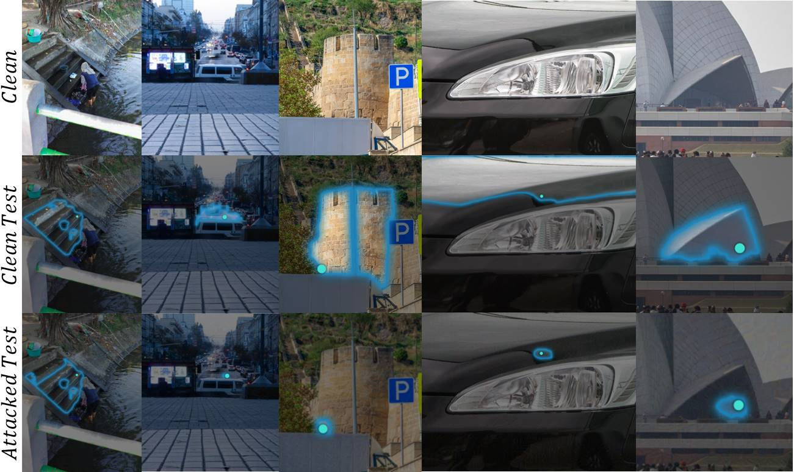

# Practical Region-level Attack against Segment Anything Models

Yifan Shen*, Zhengyuan Li*, Gang Wang

[[`Paper`](https://arxiv.org/pdf/2404.08255)]

Segment Anything Models (SAM) have made significant advancements in image segmentation, allowing users to segment target portions of an image with a single click (i.e., user prompt). Given its broad applications, the robustness of SAM against adversarial attacks is a critical concern. While recent works have explored adversarial attacks against a pre-defined prompt/click, their threat model is not yet realistic: (1) they often assume the user-click position is known to the attacker (point-based attack), and (2) they often operate under a white-box setting with limited transferability. In this paper, we propose a more practical region-level attack where attackers do not need to know the precise user prompt. The attack remains effective as the user clicks on any point on the target object in the image, hiding the object from SAM. Also, by adapting a spectrum transformation method, we make the attack more transferable under a black-box setting. Both control experiments and testing against real-world SAM services confirm its effectiveness.

<p float="left">
  
</p>

## <a name="Installation"></a>Installation
1. The code is tested on `python==3.8` and `pytorch==1.10.0`. Please install as instructed on the website.
2. Download a [model checkpoint](https://github.com/facebookresearch/segment-anything#model-checkpoints). 
3. Run
```
pip install opencv-python tqdm matplotlib scikit-learn
```

Note that you don't need to install segment-anything since we have copied their code.

## <a name="GettingStarted"></a>Getting Started
The model can be used in just a few lines to get masks from a given prompt:

```
bash run0.sh
```

Or you can run any image using following code:

```
python SSAscripts/attack.py --orig_image "dataset/sa_10550.jpg" --sam_model vit_b --checkpoint checkpoints/sam_vit_b_01ec64.pth --box 694,1436,525,1025 --epsilon 8 --apply_ssa --sam_checkpoint checkpoints/sam_vit_h_4b8939.pth --input_point 1065 775 --result_csv result/B_H_True_0.1_8_50.csv --rho 0.1 --mi -1
```
Remember to adjust parameters according to your needs.

--orig_image: Specifies the path to the original image.

--sam_model: Defines the type of SAM model used. Options might include 'vit_b', 'vit-l' and 'vit-h'.

--checkpoint: Path to the pretrained weights for the chosen SAM model. This should match the model specified in --sam_model.

--box: This parameter defines a bounding box as (minx, maxx, miny, maxy) on the image within which the adversarial perturbation will be applied.

--epsilon: The intensity of the perturbation. Typical values are 2, 4, 8, and 16.

--apply_ssa: This is a boolean flag of SSA.

--sam_checkpoint: Path to another set of pretrained weights for the SAM model that for test.

--input_point: Coordinates on the image where to attack.

--result_csv: Path where saved the results of the attack.

--rho: A parameter for adjusting the intensity of the SSA.

--mi: for density experiment only.


## Acknowledgement

Our work stands on the shoulders of giants. It relies on https://github.com/facebookresearch/segment-anything and https://github.com/yuyang-long/SSA.

## License

The model is licensed under the [Apache 2.0 license](LICENSE).

## Citing

If you use Practical Region-level Attack against SAM  in your research, please use the following BibTeX entry.

```
@article{shen2024practical,
  title={Practical Region-level Attack against Segment Anything Models},
  author={Shen, Yifan and Li, Zhengyuan and Wang, Gang},
  journal={arXiv preprint arXiv:2404.08255},
  year={2024}
}
```
